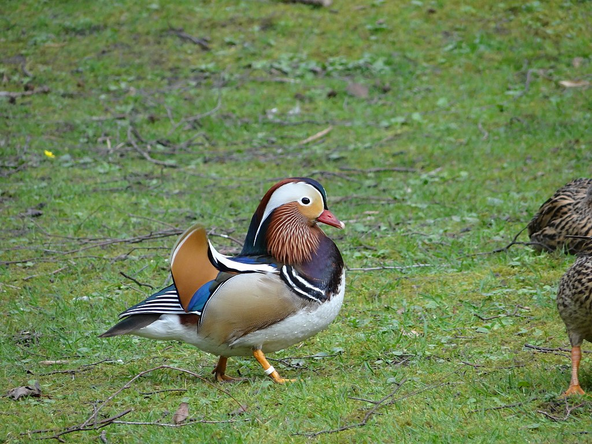

# Mobilenet Example For WASI-NN with Tensorflow Lite Backend

This package is a high-level Rust bindings for [wasi-nn] example of Mobilenet with Tensorflow Lite backend.

[wasi-nn]: https://github.com/WebAssembly/wasi-nn

## Use pre-built container image

This example is publish on the docker hub: <https://hub.docker.com/repository/docker/hydai/wasm-image-demo/>

### Prepare WasmEdge plugin enabled crun environment

And you will need to use a custom version of crun which enables the WASI-NN Plugin support.

```bash
docker pull hydai/crun:plugin_v1
# This is build from the following repo:
# https://github.com/hydai/crun/tree/enable_plugin
# With
# git clone https://github.com/hydai/crun
# cd crun
# git checkout enable_plugin
# docker build -f ./tests/wasmedge-build/Dockerfile.crun -t hydai/crun:plugin_v1 .
```

### Execute the container image

```bash
# Since we are running docker in docker, please enable the preivileged mode.
docker run --privileged --rm -it hydai/crun:plugin_v1

# Please specify `--runtime /usr/bin/crun` to make sure you are using the correct runtime
# Also, you will need to specify the `--platform=wasi/wasm` to make sure the correct architecture is used.
# The last three arguments are: WASM application file name, TensorFlow Lite model file name, and input file name.
[root@b7cee861d834 /]# podman --runtime /usr/bin/crun run --rm -it --platform=wasi/wasm docker.io/hydai/wasm-image-demo:tflite-bird-v1-plugin /wasmedge-wasinn-example-tflite-bird-image.wasm lite-model_aiy_vision_classifier_birds_V1_3.tflite bird.jpg
Trying to pull docker.io/hydai/wasm-image-demo:tflite-bird-v1-plugin...
Getting image source signatures
Copying blob f133e04bed23 done
Copying blob 3936bbfc2e6f done
Copying blob d6d9122c3588 done
Copying blob 6b9665063493 done
Copying blob e4070833a389 done
Copying config 82bdda33f9 done
Writing manifest to image destination
Storing signatures
WARN[0039] Failed to add conmon to cgroupfs sandbox cgroup: creating cgroup path /libpod_parent/conmon: write /sys/fs/cgroup/cgroup.subtree_control: device or resource busy
Error: OCI runtime error: crun-wasm: the requested cgroup controller `pids` is not available

# Please notice that it will fail and get the above error at the very first time.
# Just re-run the command again.

[root@b7cee861d834 /]# podman --runtime /usr/bin/crun run --rm -it --platform=wasi/wasm docker.io/hydai/wasm-image-demo:tflite-bird-v1-plugin /wasmedge-wasinn-example-tflite-bird-image.wasm lite-model_aiy_vision_classifier_birds_V1_3.tflite bird.jpg
WARN[0002] Failed to add conmon to cgroupfs sandbox cgroup: creating cgroup path /libpod_parent/conmon: write /sys/fs/cgroup/cgroup.subtree_control: operation not supported
Read graph weights, size in bytes: 3561598
Loaded graph into wasi-nn with ID: 0
Created wasi-nn execution context with ID: 0
Read input tensor, size in bytes: 150528
Executed graph inference
   1.) [166](198)Aix galericulata
   2.) [158](2)Coccothraustes coccothraustes
   3.) [34](1)Gallus gallus domesticus
   4.) [778](1)Sitta europaea
   5.) [819](1)Anas platyrhynchos
malloc_consolidate(): unaligned fastbin chunk detected

# We're also aware that there is a memory leak issue, it's in the WASI-NN plugin, and we are working on fixing it now.
```

## Build from source

If you want to build everything from scratch, please follow this guide. However, you can just use the above container images for the regular usage.

### Build Application

#### Dependencies

This crate depends on the `wasi-nn` in the `Cargo.toml`:

```toml
[dependencies]
wasi-nn = "0.3.0"
```

#### Build

Compile the application to WebAssembly:

```bash
cd rust/tflite-bird && cargo build --target=wasm32-wasi --release
```

The output WASM file will be at [`rust/tflite-bird/target/wasm32-wasi/release/wasmedge-wasinn-example-tflite-bird-image.wasm`](wasmedge-wasinn-example-tflite-bird-image.wasm).
To speed up the image processing, we can enable the AOT mode in WasmEdge with:

```bash
wasmedgec rust/tflite-bird/target/wasm32-wasi/release/wasmedge-wasinn-example-tflite-bird-image.wasm wasmedge-wasinn-example-tflite-bird-image.wasm
```

#### Run the application with WasmEdge CLI

##### Download fixture

The testing image is located at `./bird.jpg`:



The `tflite` model is located at `./lite-model_aiy_vision_classifier_birds_V1_3.tflite`

##### Generate Image Tensor

If you want to generate the [raw](birdx224x224x3.rgb) tensor, you can run:

```shell
cd rust/image-converter/ && cargo run ../../bird.jpg ../../birdx224x224x3.rgb
```

##### Execute

Users should [install the WasmEdge with WASI-NN TensorFlow-Lite backend plug-in](https://wasmedge.org/book/en/write_wasm/rust/wasinn.html#get-wasmedge-with-wasi-nn-plug-in-tensorflow-lite-backend).

Execute the WASM with the `wasmedge` with Tensorflow Lite supporting:

```bash
wasmedge --dir .:. wasmedge-wasinn-example-tflite-bird-image.wasm lite-model_aiy_vision_classifier_birds_V1_3.tflite bird.jpg
```

You will get the output:

```console
Read graph weights, size in bytes: 3561598
Loaded graph into wasi-nn with ID: 0
Created wasi-nn execution context with ID: 0
Read input tensor, size in bytes: 150528
Executed graph inference
   1.) [166](198)Aix galericulata
   2.) [158](2)Coccothraustes coccothraustes
   3.) [34](1)Gallus gallus domesticus
   4.) [778](1)Sitta europaea
   5.) [819](1)Anas platyrhynchos
```

#### Package the WASM application into a container image

You can find the details from the `Dockerfile`.

```Dockerfile
FROM scratch
# Add the TensorFlow lite library as the WASI-NN plugin dependency.
ADD libtensorflowlite_c.so /
# Add WasmEdge WASI-NN Plugin
ADD libwasmedgePluginWasiNN.so /

# Add WASM application
ADD wasmedge-wasinn-example-tflite-bird-image.wasm /
# Add the tflite model file
ADD lite-model_aiy_vision_classifier_birds_V1_3.tflite /
# Add input image, you can add more input images here
ADD bird.jpg /
# This is for the container entry, give a hint to users that they will need to specify the application name, model file, and input file.
CMD ["/wasmedge-wasinn-example-tflite-bird-image.wasm", "lite-model_aiy_vision_classifier_birds_V1_3.tflite", "bird.jpg"]
```
